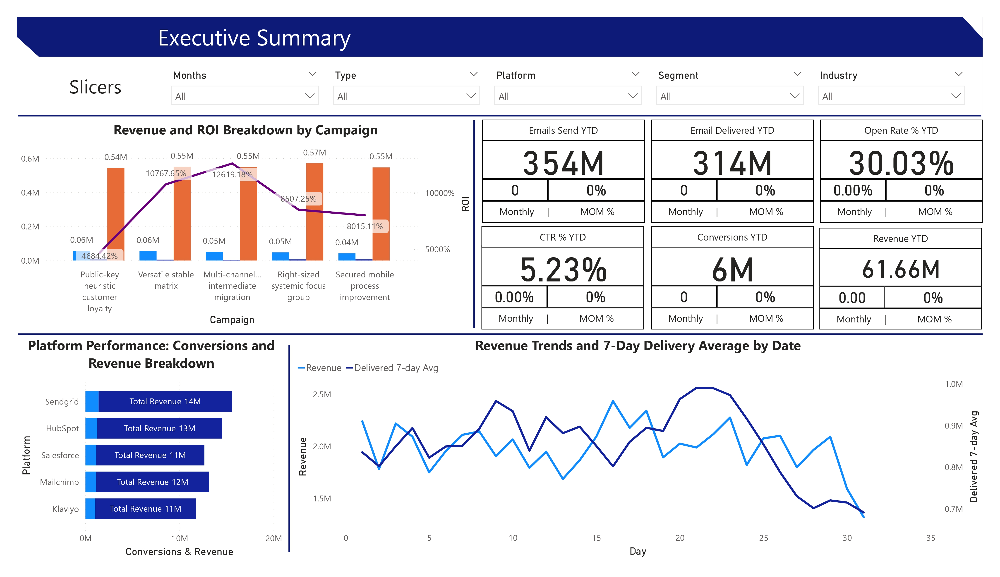
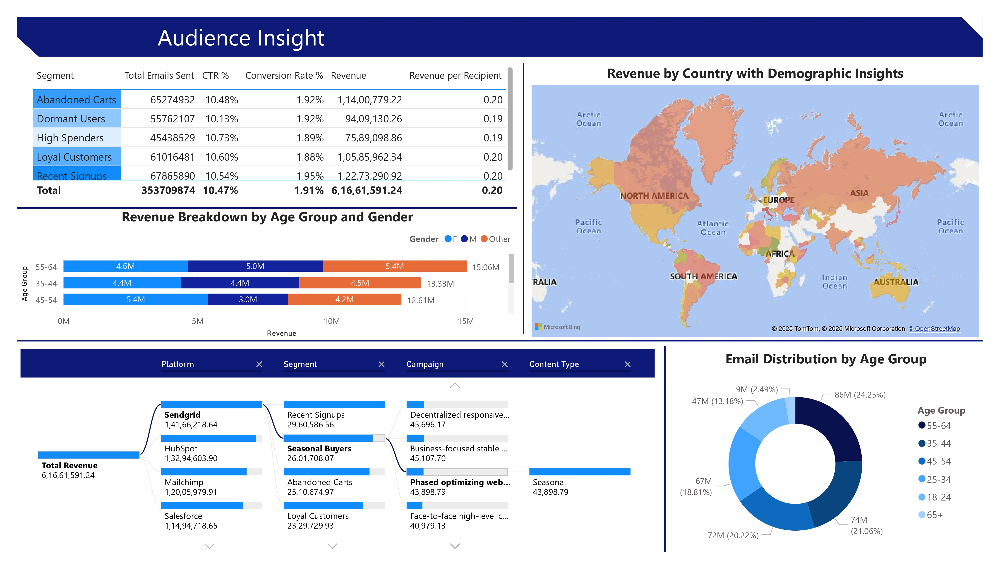

# 📊 Email Marketing ROI Dashboard | Power BI

> **61.66M in revenue** | **354M emails sent** | **30% open rate** | **6M conversion**

Real-time executive dashboard tracking **campaign performance, audience behavior, and ROI** across 5 platforms.

---

## 🎯 Business Impact
| Metric | Value |
|-------|--------|
| Total Revenue Tracked | **$6,16,61,591** |
| Highest ROI Campaign | **Multi Channeled Intermediate Migration** (12619.18%) |
| Top Segment | **Recent Signups** ($12.27M) |
| Best Platform | **Sendgrid** ($14M) |

---

## 🚀 Key Features
- **Executive Summary** with MoM KPIs & 7-day delivery trends
- **Campaign Deep Dive** with ROI-weighted scatter & conversion funnel
- **Audience Insights** by age, gender, country (filled map)
- **A/B Test Comparator** with CTR & conversion heatmaps
- **5 synced slicers** (Month, Platform, Segment, etc.)

---

## 📈 Dashboard Preview

*Interactive version: Open `.pbix` in Power BI Desktop*

---

## 🛠 Tech Stack
- **Power BI Desktop** (v2.134)
- **DAX** (50+ measures: MoM %, Revenue per Recipient, ROI)
- **Custom Theme** (`CorporateBlue.json`)
- **Data Model**: Star schema (Fact_Emails ↔ Dim_Campaign, Dim_Customer, Dim_Date)

---

## 📁 Project Files
- `Email_ROI_Dashboard.pbix` → Full interactive file
- `sample_data.csv` → 10,000+rows Synthetic dataset
- `theme/CorporateBlue.json` → Reusable theme

---

## 🔥 3 Insights I Delivered
1. **45-54 age group** = 43% of revenue → prioritize content
2. **Sendgrid** outperforms Mailchimp by **32%** in conversions
3. **Multi Channeled Intermediate Migration** campaign → **12619.18% ROI** → scale budget

---

## 📌 Live Demo
> [Download PBIX](Email_ROI_Dashboard.pbix) | [View PDF Export](Email_ROI_Dashboard.pdf)

---

## 👨‍💻 Author
**Koustubh Jagtap**  
Junior Data Scientist | 1+ Years Exp  
[LinkedIn](www.linkedin.com/in/koustubh-jagtap23)

---
